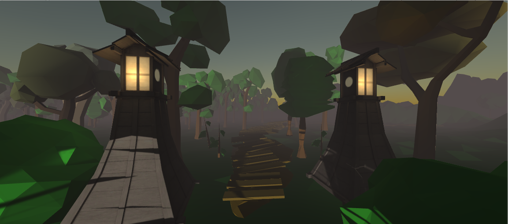
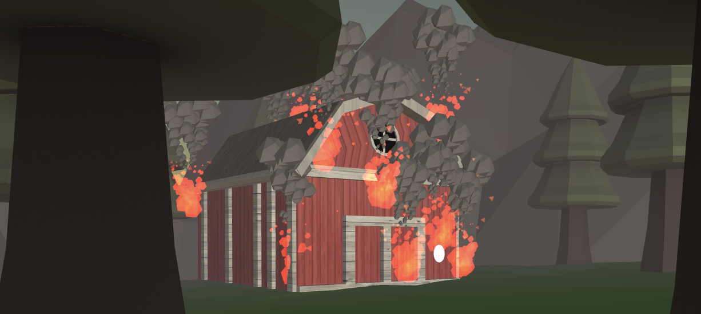

# Media Transformation Project

# README

Das Ziel unserer Virtual Reality Umgebung ist es, den/die Nutzer*in die oft realistisch und doch gleichzeitig surreal wirkende Welt von Murakamis Kurzgeschichten - in diesem Fall ,,Scheunenabbrennen” -  eintauchen zu lassen. Hierbei setzen wir besonders Wert auf die Audio-Erfahrung und wollen dem User über Sounds und Musik die Atmosphäre nahe bringen. Die surreale, fast märchenhaft wirkende Umgebung in vielen von Murakamis Geschichten greifen wir hier so auf, indem wir ein verwirrendes Spiel-Erlebnis für den/die Nutzer*in schaffen. Da besonders in der vorgegebenen Kurzgeschichte Paranoia als Motiv zu erkennen ist, stellen wir diese in unserem Spiel dar. Wir drücken durch die sich immer wiederholenden Worte und das Schnipsen der männlichen Nebenfigur (Ben) diese Paranoia und die Vereinnahmung des Protagonisten durch Ben aus. So geht er in seiner Verzweiflung und Besessenheit auf die Suche nach den von Ben erwähnten Scheunen und durchlebt einen Albtraum. 
Bei unserem Spiel-Design haben wir uns für eine Low Poly-Optik entschieden, da diese  jedem sehr bekannt und nah ist und obwohl sie klassischerweise für eine leichte Spielerfahrung steht, kombinieren wir sie hier mit einer düsteren Optik, verstärkt durch dunkle Beleuchtung und Nebel, die weiterhin ein Gefühl von Orientierungslosigkeit unterstreichen. Diese Optik spiegelt auch die inhaltliche Dualität wieder: diese naturalistische Landschaft birgt ein Geheimnis in sich, welchem sich der Spieler stellen muss. Das Low-Poly-Design in Verbindung mit dem Nebel, der Musik und grundsätzlich geschaffenen Atmosphäre unterstreicht diese Gegensätzlichkeit. 
Kleine gelbe Pfeile erleuchten im Nebel und geben dem User eine kleine Orientierung.
Weiterhin ist die Umgebung an die Kurzgeschichte angelehnt, speziell an die dort erwähnte Joggingroute und die Suche des Hauptcharakters nach den vermeintlich verbrannten Scheunen, wobei man sich die Frage stellt, wonach er wirklich sucht. In der Geschichte erwähnte Elemente, wie ein Pepsi-Schild (bei uns ,,Pipsi” genannt) in der Nähe einer Scheune oder die Landschaft mit ihren Hügeln und Flüssen, werden dargestellt. Die Immersion des/der Spielenden wird in der Nähe einer Scheune durch die Erhöhung des Volumens von Musik und Akustik verstärkt und erreicht bei der letzten Scheune ihren Höhepunkt: sie fängt an zu brennen.

Weiterhin sind im Laufe des Spielverlaufs die Gedanken des Protagonisten sowie seine Gespräche mit Ben zu hören, um somit die innere Zerstreutheit aufzuzeigen.

# Der Spielverlauf
Unser Spiel beginnt mit dem Menü: hier kann man auswählen, ob man direkt mit dem eigentlichen Spiel beginnt oder sich zunächst ein Intro mit der Vorgeschichte der Charaktere anhört. 
Mittels gleichzeitigem Drücken von ,,Alt” bei Windows- bzw. der ,,Wahltaste” bei macOS-Geräten kann man die Sicht steuern. Hierbei dient ein kleiner weißer KReis zur Orientierung. Mit einem Rechtsklick wird dann die Wahl von z.B. den Buttons im Menü bestätigt. Über das Handy reicht es, lange genug auf diese Trigger zu schauen, um sie auszulösen.
Das Intro bringt den/die Nutzer*in in eine vollkommen abgedunkelte Szene, die das Raumgefühl vermissen lässt und somit bereits ein erstes Gefühl von Verwirrung aufbringt. Bloß der Text zur Vorgeschichte und das Audio, welches diesen ,,vorliest” und auch das wiederkehrende Schnipsen beinhaltet, sind wahrzunehmen und deuten so bereits auf die Besessenheit des Protagonisten - nur diese Worte laufen durch seinen Kopf. Nach Ablauf des Intros brennt eine Scheune kurz ab, wie in einem Albtraum und man erwacht im eigentlichen Spiel.
Wenn man auf ,,PLAY” drückt, gelangt man in die erste Szene des Spiels: zunächst sieht man auch hier noch die Szene des Albtraums, ehe man sich in einem ,,Aufwachraum” in der Wohnung des Protagonisten wiederfindet. Hier findet sich an der Wand eine erste Spielanleitung, die den Spieler dazu bewegt, sich auf die Suche nach der ersten Scheune zu machen. Wenn man sich der Tür nähert und hierbei den Knauf fokussiert, wechselt die Szene und man befindet sich draußen, vor seinem Haus. In dieser Szene, die den ersten Tag darstellt, soll der Spieler nach der ersten Scheune suchen. 

Die Scheunen sind alle denen aus der Kurzgeschichte nachempfunden, so befindet sich eine hinter den Hügeln, eine im Wald oder auch an einem Fluss. 
Wenn der User sich in die richtige Richtung und näher zur Scheune bewegt, werden Sounds abgespielt, die je nach Nähe lauter werden. Zudem werden die Gespräche zwischen dem Protagonisten und Ben wieder abgespielt, wobei es Sinn macht, diese Spielerfahrung mit Kopfhörern zu durchleben, da die Gespräche und die Sounds rechts- bzw. linkslastig sind, um den Spielern des Spiels auch eine Orientierungshilfe bei der Suche nach den Scheunen zu geben; dadurch lässt sich besser erahnen, wo diese sich befinden. Außerdem sind immer wieder das Schnipsen und eine beunruhigende Musik zu hören, um die richtige Atmosphäre zu schaffen. Im Zuge dessen hört man also die Gedanken des Protagonisten, welcher sich immer wieder fragt, wo die weibliche Hauptfigur, Haemi, ist, da er länger nichts von ihr gehört hat. Während des Laufens sind auch die Schritte auf dem Boden zu hören. 
Nach Finden der Scheune und somit dem Erfüllen der Mission wird der nächste Tag/ die nächste Szene getriggert. Dieser Ablauf wiederholt sich viermal. Bei der letzten Scheune ertönt ein zusätzliches Feuer-Knacken, was ein bedrückendes Gefühl verschaffen soll. Wenn man dann nah genug vor der Scheune steht, beginnt diese zu brennen und man findet sich in der Alptraum-Sequenz des Intros wieder. Es wird offen gelassen, ob das ganze Geschehen nur ein Traum oder Realität war und tatsächlich eine Scheune abbrannte. Ebenso begegnet man nicht Haemi, um die Frage nach ihrem Verschwinden unbeantwortet und den/die Nutzer*in verwirrt und fragend zurückzulassen.

